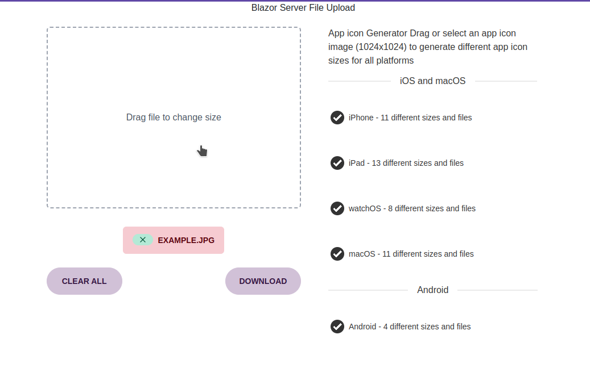

# IconSizer

IconSizer is an image resizing application developed using C#, Blazor, Tailwind CSS, and Docker. This project aims to provide a convenient way to resize images and generate a ZIP file containing the resized images. Please note that this project is still under development and not yet finished.



## Installation

To install and run IconSizer locally, follow the instructions below:

### Prerequisites

Make sure you have the following tools installed on your system:

- [.NET 6 SDK](https://dotnet.microsoft.com/download/dotnet/6.0)
- [Docker](https://www.docker.com/products/docker-desktop)

### Clone the Repository

Clone this repository to your local machine using the following command:

```shell
git clone https://github.com/DopeySlime/IconSizer.git
```

### Build and Run Locally

1. Navigate to the project directory:

   ```shell
   cd IconSizer
   ```

2. Build the application:

   ```shell
   dotnet build
   ```

3. Run the application:

   ```shell
   dotnet run
   ```

4. Access the application in your web browser by visiting `https://localhost:5000`.

### Using Docker

Alternatively, you can run IconSizer using Docker:

1. Navigate to the project directory:

   ```shell
   cd IconSizer
   ```

2. Build the Docker image:

   ```shell
   docker build -t iconsizer .
   ```

3. Run the Docker container:

   ```shell
   docker run -p 8080:80 iconsizer
   ```

4. Access the application in your web browser by visiting `https://localhost:8080`.

## Usage

1. Upload an image file 1024x1024.

2. Specify the desired dimensions for the resized images.

3. Click on the "Resize" button to initiate the resizing process.

4. Once the resizing is complete, click on the "Download ZIP" button to download a ZIP file containing the resized images.

## License

IconSizer is licensed under the [MIT License](LICENSE).

## Disclaimer

This project is still under development and may contain bugs(many bugs) or incomplete features. Use it at your own risk.
